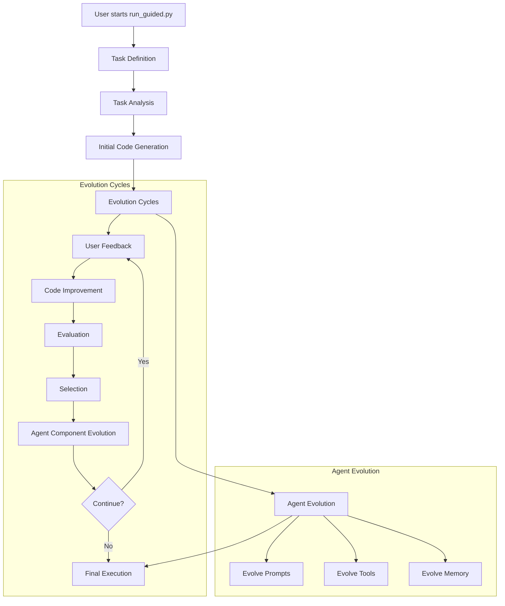
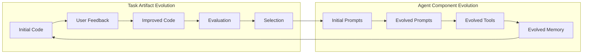

# 🚀 **evo-agent-alpha-avolve-palantir**

An advanced evolutionary agent system that evolves both **task artifacts** (code) and **agent components** (prompts, tools, memory) through guided interaction.

## 🎯 **Quick Start**

### **1. Clone & Setup**
```bash
git clone https://github.com/GirishVerm/evo-agent-alpha-avolve-palantir.git
cd evo-agent-alpha-avolve-palantir/evo-agent
pip install -r requirements.txt
```

### **2. Run the Guided Agent**
```bash
python run_guided.py
```

## 🔧 **Azure OpenAI Configuration**

The system is **pre-configured** with Azure OpenAI credentials:

```python
# Current Configuration (llm_interface.py)
azure_endpoint: str = "https://vinod-m7y6fqof-eastus2.cognitiveservices.azure.com/"
api_key: str = "CxjrfpmQJB9TxEWZSTRzKTDIbqozO3kvx8S6yO0MGnfa8cdQ7HDMJQQJ99BCACHYHv6XJ3w3AAAAACOGevLG"
deployment_name: str = "o4-mini"
api_version: str = "2024-12-01-preview"
```

**No additional setup required!** The system is ready to run with these credentials.

## 🧠 **How `run_guided.py` Works**

The guided agent performs **dual evolution**: evolving both the **task artifacts** (your code) and the **agent itself** (its prompts, tools, and memory).

### **System Flow**



### **Dual Evolution Process**



## 📋 **Step-by-Step Process**

### **Step 1: Task Definition**
```
📝 TASK SETUP
Task name: Create a Fibonacci calculator
Description: A function that calculates Fibonacci numbers efficiently
Requirements: 
- Handle positive integers
- Return the nth Fibonacci number
- Include error handling
Success criteria:
- Correct results for test cases
- Efficient performance
- Proper error handling
```

### **Step 2: Task Analysis**
The agent analyzes your task and breaks it down into implementable components.

### **Step 3: Initial Code Generation**
```python
def fibonacci(n):
    if n <= 0:
        raise ValueError("Input must be positive")
    if n == 1 or n == 2:
        return 1
    return fibonacci(n-1) + fibonacci(n-2)
```

### **Step 4: Evolution Cycles (Up to 5 cycles)**

For each cycle, the system:

1. **Gets User Feedback**: You provide improvement suggestions
2. **Improves Code**: Agent generates improved version
3. **Evaluates Both**: Compares current vs. improved code
4. **Selects Better**: Keeps the better version
5. **Evolves Agent**: Updates agent components every 2 cycles

**Example Evolution Cycle:**
```
🔄 EVOLUTION CYCLE 1
💬 Provide feedback for improvement: Add memoization for better performance

📊 EVALUATION RESULTS:
Current code - Overall: 0.750
Improved code - Overall: 0.920
✅ Improved code selected!
```

### **Step 5: Agent Component Evolution**

Every 2 cycles, the agent evolves its own components:

```python
# Initial Agent Components
prompts = {
    "code_generation": "Create a Python function that meets the given requirements.",
    "code_improvement": "Improve this code by adding error handling, documentation, and optimization.",
    "task_analysis": "Analyze this task and break it down into implementable components.",
    "code_evaluation": "Evaluate this code for correctness, performance, and robustness."
}

tools = {
    "code_tester": "def test_code(code, test_cases): return {'passed': len([t for t in test_cases if eval(t)]), 'total': len(test_cases)}",
    "performance_analyzer": "def analyze_performance(code): return {'complexity': 'O(n)', 'efficiency': 0.8}",
    "code_quality_checker": "def check_quality(code): return {'readability': 0.7, 'maintainability': 0.8, 'documentation': 0.6}"
}

memory = {
    "context_manager": "def store_context(task, result): return {'task': task, 'result': result, 'timestamp': time.time()}",
    "knowledge_base": "def retrieve_knowledge(query): return 'relevant_patterns_and_solutions'",
    "experience_logger": "def log_experience(action, outcome): return {'action': action, 'outcome': outcome, 'success': outcome > 0.5}"
}
```

**Evolved components become more sophisticated** based on the task context and user feedback.

### **Step 6: Final Execution**
```
🎯 EXECUTING THE FINAL TASK...
✅ TASK EXECUTION COMPLETE!
Function: fibonacci
Success Rate: 100.0%

💰 COST STATISTICS:
Total cost: $0.0234
Total requests: 12
Generations: 2
```

## 🎛️ **Configuration**

### **Agent Configuration (guided_agent.py)**
```python
@dataclass
class AgentConfig:
    max_cost: float = 20.0              # Maximum cost per experiment
    evolution_frequency: int = 2         # Evolve agent every N generations
    population_size: int = 3             # Population size for evolution
    max_generations: int = 5             # Maximum evolution cycles
```

### **Evaluation Metrics**
The system evaluates code on three objectives:
- **Correctness** (40%): Does the code work correctly?
- **Performance** (30%): Is the code efficient?
- **Robustness** (30%): Does the code handle edge cases?

## 📊 **Example Session**

```
🚀 Starting Guided Evolutionary Agent...
==================================================
This agent will guide you through:
• Setting up a task
• Analyzing the requirements
• Generating and improving code
• Evolving the agent itself
• Executing the final result
==================================================

📝 TASK SETUP
Task name: Create a Fibonacci calculator
Description: A function that calculates Fibonacci numbers efficiently
Requirements: 
- Handle positive integers
- Return the nth Fibonacci number
- Include error handling
Success criteria:
- Correct results for test cases
- Efficient performance
- Proper error handling

🔄 EVOLUTION CYCLE 1
💬 Provide feedback for improvement: Add memoization for better performance

📊 EVALUATION RESULTS:
Current code - Overall: 0.750
Improved code - Overall: 0.920
✅ Improved code selected!

🎯 EXECUTING THE FINAL TASK...
✅ TASK EXECUTION COMPLETE!
Function: fibonacci
Success Rate: 100.0%

💰 COST STATISTICS:
Total cost: $0.0234
Total requests: 12
Generations: 2

🎉 EVOLUTION COMPLETE! The agent has evolved and created working code!
```

## 🔍 **Key Features**

### **Dual Evolution**
- **Task Artifacts**: Your code evolves through user feedback
- **Agent Components**: Prompts, tools, and memory evolve automatically

### **Intelligent Recommendations**
- AI suggests whether to continue evolution
- Provides feedback suggestions based on code analysis
- Confidence scoring for recommendations

### **Cost Management**
- Budget-aware LLM usage
- Real-time cost tracking
- Automatic stopping when budget exceeded

### **Multi-Objective Evaluation**
- Evaluates code on correctness, performance, and robustness
- Pareto-optimal selection between versions
- Comprehensive fitness scoring

## 🚨 **Troubleshooting**

### **Common Issues**

1. **"Module not found" errors**
   ```bash
   pip install -r requirements.txt
   ```

2. **Azure API quota exceeded**
   - Check your Azure OpenAI quota
   - Reduce `max_cost` in configuration
   - Wait for quota reset

3. **Agent not responding**
   - Check internet connection
   - Test with `python test_llm.py`

### **Testing Azure Connection**
```bash
python test_llm.py
```

## 📈 **What Makes This Special**

1. **Self-Evolving Agent**: The agent itself evolves its capabilities
2. **Dual Optimization**: Both task artifacts and agent components improve
3. **Guided Interaction**: Step-by-step process with user feedback
4. **Cost-Aware**: Built-in budget management
5. **Multi-Objective**: Evaluates multiple aspects of code quality

The system represents a significant step toward **AlphaEvolve-grade** self-improving agents that can evolve both their outputs and their own capabilities! 🚀
