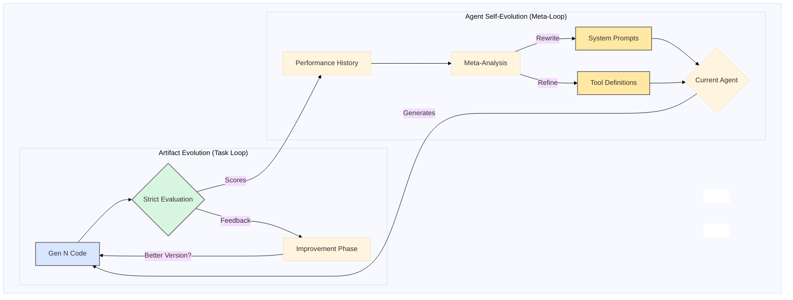

# AlphaEvolve Guided Agent

A technical demonstration of a self-improving evolutionary agent that optimizes both its outputs (code) and its own internal components (prompts, tools).

Unlike standard agents that are static, this system implements **Dual Evolution**:
1.  **Artifact Evolution**: Iteratively improving user-requested code using genetic algorithm-inspired selection.
2.  **Agent Evolution**: The agent rewrites its own system prompts and tool definitions based on success metrics.

## Dual Evolution Architecture

The system operates on two interlocking feedback loops. The **Artifact Loop** improves the user's code, while the **Meta-Loop** improves the agent's ability to write code.



### 1. Artifact Loop
- **Goal**: Solve the user's task (e.g., "Write a Thread-Safe LRU Cache").
- **Process**: Generate -> Evaluate -> Improve -> Select Best.
- **Metric**: Pass rate on unit tests, execution speed, code quality scores.

### 2. Meta-Loop
- **Goal**: Make the agent smarter.
- **Process**: Analyze past generations -> Identify weaknesses (e.g., "The agent keeps forgetting to import libraries") -> Rewrite system prompts or tool code to fix the systemic issue.
- **Result**: A `code_tester` tool that starts simple but evolves to handle timeouts, multiprocessing, and edge cases automatically.

## Key Capabilities

### 1. Type-Safe Evaluation (Pydantic)
We do not rely on "vibes" or LLM-based grading alone.
- **Strict Validation**: All evaluation criteria (`TaskSpec`) are validated against strict Pydantic schemas.
- **Metric-Driven**: Success is measured by concrete metrics: Correctness (pass rate), Performance (execution time), and Robustness (edge case handling).

### 2. Synthetic Test Generation
The agent doesn't just write code; it writes its own tests.
- **Hard Eval Suite**: The agent proactively asks the LLM to generate "hard" edge cases (e.g., negative inputs, large datasets) to break its own code.
- **Self-Verification**: These synthetic tests form the "Success Criteria" that the code must pass to survive.

### 3. Sandboxed Execution (`code_tester`)
The agent starts with a basic `eval()` tool but quickly evolves a robust execution engine:
- **Multiprocessing**: Code runs in isolated processes to prevent crashes.
- **Timeouts**: Signal-based timeouts prevent infinite loops.
- **Restricted Globals**: Execution happens in a namespace with only safe built-ins allowed.

### 4. Hygiene & Safety Checks
Before running any code, the agent performs static analysis:
- **Syntax Check**: Ensures code is valid Python.
- **Import Scanning**: Blocks dangerous imports (like `os` or `subprocess` in untrusted contexts).

## Detailed Workflow

When you run the agent, the following sequence occurs:

1.  **Task Analysis**: The agent breaks down the user request into technical requirements and defines a `TaskSpec`.
2.  **Initial Generation**: The agent writes the first version of the code (`gen_1.py`).
3.  **Evaluation Cycle**:
    *   The code is passed to `EvaluationFramework`.
    *   Unit tests are generated and executed in the sandbox.
    *   Performance benchmarks are run.
4.  **Feedback Loop**:
    *   If scores are low, the agent receives a structured report containing the specific errors.
    *   The agent uses its `code_improvement` prompt to fix the issues.
5.  **Meta-Reflection**:
    *   After N generations, the agent reviews its own logs.
    *   If it notices it struggles with a specific aspect (e.g., concurrency), it updates its own system prompts to emphasize that aspect in future generations.

## Project Structure & Artifacts

All generated files are saved in the `evo_agent/` directory:

```
AlphaEvolve-Agent/
├── evo_agent/
│   ├── code/                    # 📄 Generated Code
│   │   ├── gen_1.py             # Initial attempt
│   │   ├── gen_2.py             # Improved version
│   │   └── gen_3.py             # Optimized version
│   ├── evaluations/             # 📊 Score Reports
│   │   ├── gen_1.txt            # "Correctness: 0.5..."
│   │   └── gen_2.txt            # "Correctness: 0.9..."
│   ├── prompts/                 # 🤖 Evolved Prompts
│   │   ├── gen_1.txt            # Base prompts
│   │   └── gen_2.txt            # Self-improved prompts
│   ├── guided_agent.py          # Main agent logic
│   ├── evaluation_framework.py  # Test runner
│   └── models.py                # Pydantic models
```

**Note**: The `gen_*.py` files are ignored by git so they don't clutter the repo, but you can inspect them locally to see the agent's progress.

## Setup & Usage

### Prerequisites
*   Python 3.10+
*   OpenAI API Key (or Azure OpenAI credentials)

### Installation

1.  Clone the repository:
    ```bash
    git clone https://github.com/GirishVerm/AlphaEvolve-Agent.git
    cd AlphaEvolve-Agent
    ```

2.  Install dependencies:
    ```bash
    pip install -r requirements.txt
    ```

3.  Configure environment:
    ```bash
    cp .env.example .env
    # Edit .env with your API keys
    ```

### Running the Agent

To start the guided evolution process:

```bash
python3 evo_agent/run_guided.py
```

### Providing Custom Specs

You can provide your task specifications in two ways:

1.  **Interactive Mode**: The agent will ask you for:
    *   Task Name
    *   Description
    *   Requirements
    *   Success Criteria

2.  **Environment Variables** (for automation):
    ```bash
    export AGENT_TASK_NAME="Fibonacci"
    export AGENT_TASK_DESCRIPTION="Calculate Nth Fibonacci number"
    export AGENT_TASK_REQUIREMENTS="Handle negative inputs, optimize for large N"
    python3 evo_agent/run_guided.py
    ```
