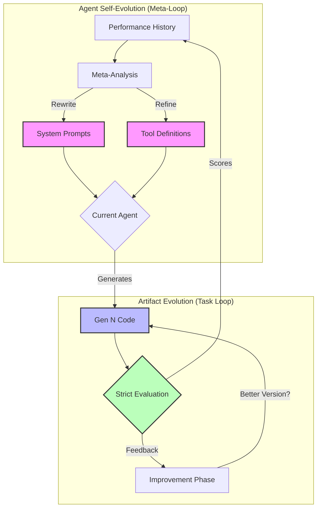

# AlphaEvolve Guided Agent

A technical demonstration of a self-improving evolutionary agent that optimizes both its outputs (code) and its own internal components (prompts, tools).

Unlike standard agents that are static, this system implements **Dual Evolution**:
1.  **Artifact Evolution**: Iteratively improving user-requested code using genetic algorithm-inspired selection.
2.  **Agent Evolution**: The agent rewrites its own system prompts and tool definitions based on success metrics.

## Dual Evolution Architecture

The system operates on two interlocking feedback loops. The **Artifact Loop** improves the user's code, while the **Meta-Loop** improves the agent's ability to write code.



### 1. Artifact Loop
- **Goal**: Solve the user's task (e.g., "Write a Thread-Safe LRU Cache").
- **Process**: Generate -> Evaluate -> Improve -> Select Best.
- **Metric**: Pass rate on unit tests, execution speed, code quality scores.

### 2. Meta-Loop
- **Goal**: Make the agent smarter.
- **Process**: Analyze past generations -> Identify weaknesses (e.g., "The agent keeps forgetting to import libraries") -> Rewrite system prompts or tool code to fix the systemic issue.
- **Result**: A `code_tester` tool that starts simple but evolves to handle timeouts, multiprocessing, and edge cases automatically.

## Core Components

### Strict Evaluation Engine (`evaluation_framework.py`)
We do not rely on LLM-based grading alone.
- **Pydantic Validation**: All evaluation criteria (`TaskSpec`) are validated against strict schemas.
- **Security Guardrails**: The system proactively scans for banned tokens (e.g., `import os`, `subprocess`) in generated test specs before execution.
- **Metric-Driven**: Success is measured by concrete metrics: Correctness (pass rate), Performance (execution time), and Robustness (edge case handling).

### Sandboxed Execution (`code_tester`)
The agent starts with a basic `eval()` tool but quickly evolves a robust execution engine:
- **Multiprocessing**: Code runs in isolated processes to prevent crashes.
- **Timeouts**: Signal-based timeouts prevent infinite loops.
- **Restricted Globals**: Execution happens in a namespace with only safe built-ins allowed.

## Detailed Workflow

When you run the agent, the following sequence occurs:

1.  **Task Analysis**: The agent breaks down the user request into technical requirements and defines a `TaskSpec`.
2.  **Initial Generation**: The agent writes the first version of the code (`gen_1.py`).
3.  **Evaluation Cycle**:
    *   The code is passed to `EvaluationFramework`.
    *   Unit tests are generated and executed in the sandbox.
    *   Performance benchmarks are run.
4.  **Feedback Loop**:
    *   If scores are low, the agent receives a structured report containing the specific errors.
    *   The agent uses its `code_improvement` prompt to fix the issues.
5.  **Meta-Reflection**:
    *   After N generations, the agent reviews its own logs.
    *   If it notices it struggles with a specific aspect (e.g., concurrency), it updates its own system prompts to emphasize that aspect in future generations.

## Project Structure

```
AlphaEvolve-Agent/
├── evo_agent/
│   ├── guided_agent.py          # Main agent logic & evolution loop
│   ├── evaluation_framework.py  # Test runner & scoring engine
│   ├── models.py                # Pydantic data models & validators
│   ├── code/                    # Generated code artifacts (Gen 1..N)
│   ├── prompts/                 # Evolved agent prompts (Gen 1..N)
│   ├── evaluations/             # Detailed score reports
│   └── tools/                   # Evolved tool definitions
├── src/
│   ├── agent.py                 # Base agent template
│   └── llm_interface.py         # Abstraction for LLM calls
├── requirements.txt             # Python dependencies
└── run_guided.py                # Entry point script
```

## Example Evolution Session

Below is an example of the agent improving a "Thread-Safe LRU Cache".

### Generation 1 (Baseline)
**Input**: "Implement a Thread-Safe LRU Cache."
**Output**: A standard Python `OrderedDict` implementation.
**Evaluation**:
*   Correctness: 100% (It works for single thread)
*   Robustness: 20% (Fails under high concurrency)
*   **Overall Score: 0.45**

### Generation 2 (Improvement)
**Feedback**: "The implementation causes race conditions under load. Use proper locking."
**Output**: Added `threading.RLock` around `get` and `put` methods.
**Evaluation**:
*   Correctness: 100%
*   Robustness: 90% (Passes stress tests)
*   Performance: 40% (Global lock slows down high-throughput reads)
*   **Overall Score: 0.70**

### Generation 3 (Optimization)
**Feedback**: "Performance is bottlenecked by the global lock."
**Output**: Implemented lock striping (sharding) to allow concurrent reads.
**Evaluation**:
*   Correctness: 100%
*   Robustness: 90%
*   Performance: 85%
*   **Overall Score: 0.92**

## Setup & Usage

### Prerequisites
*   Python 3.10+
*   OpenAI API Key (or Azure OpenAI credentials)

### Installation

1.  Clone the repository:
    ```bash
    git clone https://github.com/GirishVerm/AlphaEvolve-Agent.git
    cd AlphaEvolve-Agent
    ```

2.  Install dependencies:
    ```bash
    pip install -r requirements.txt
    ```

3.  Configure environment:
    ```bash
    cp .env.example .env
    # Edit .env with your API keys
    ```

### Running the Agent

To start the guided evolution process:

```bash
python3 evo_agent/run_guided.py
```

The agent will ask for a task description. You can observe the evolution process in real-time in the terminal, and view the artifacts in the `evo_agent/code/` directory.
